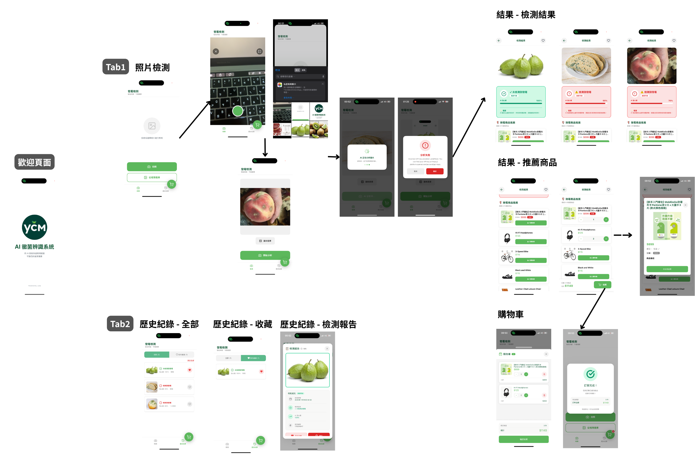
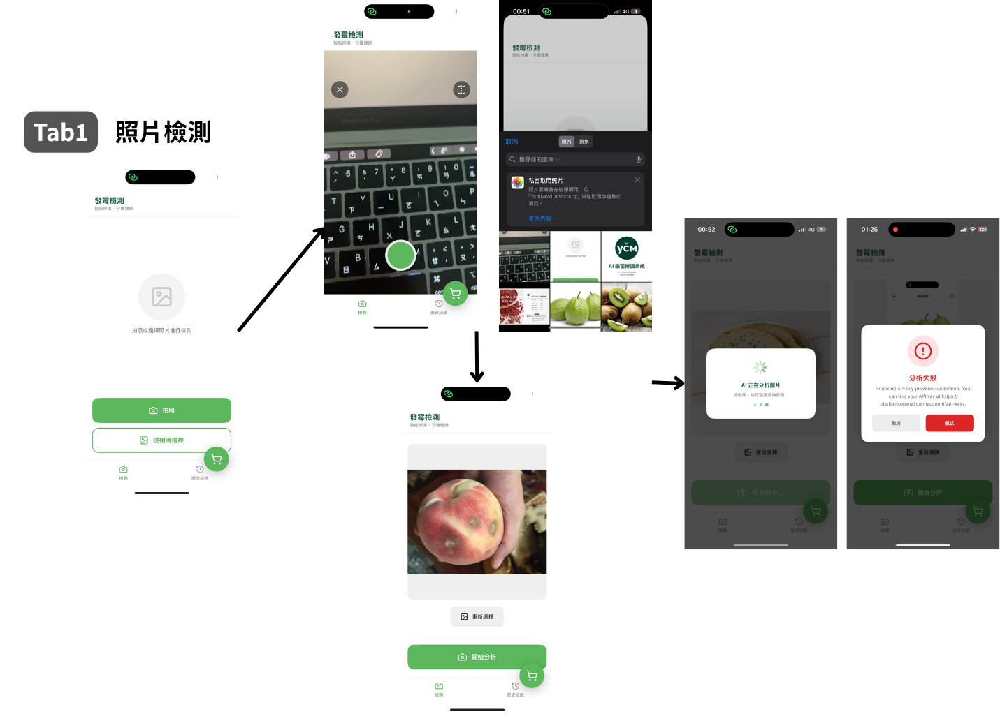
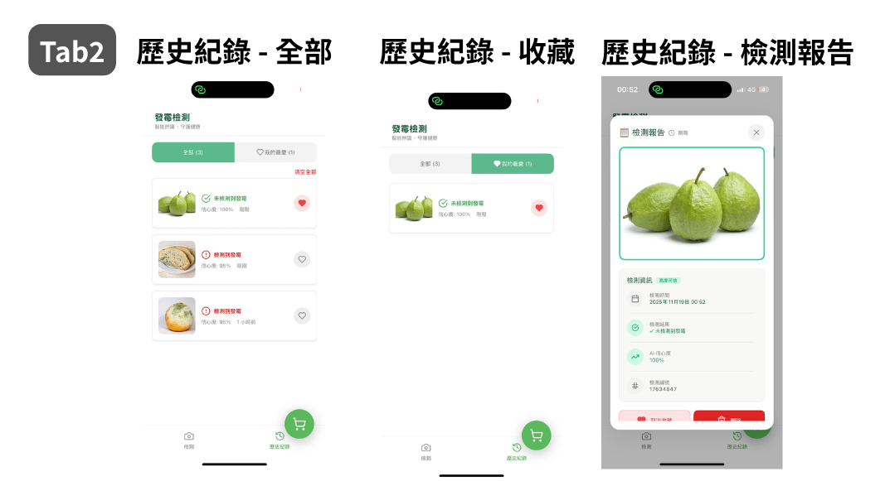
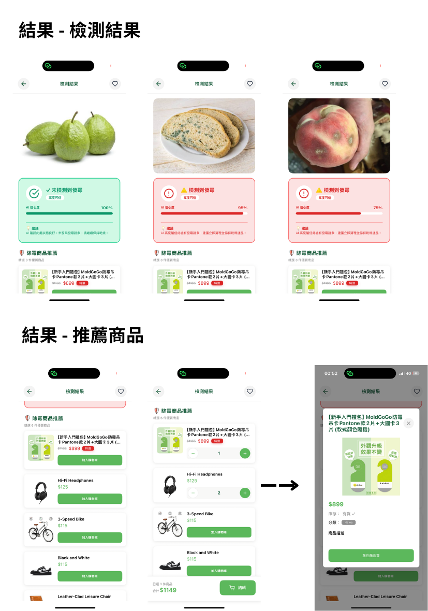
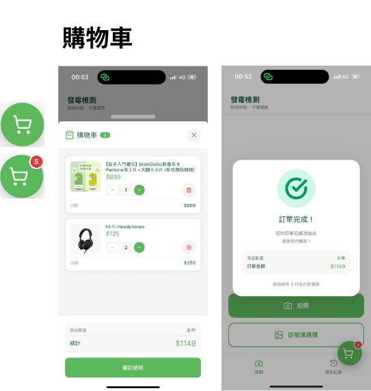

# YcmMoldDetectApp - 專案文檔

## 📋 目錄總結構


```
🗂️src/
├── 🗂️components/                 # 共用 UI 元件（SafeArea等）
│
├── 🗂️navigation/                 # Navigation 設定
│
├── 🗂️screens/                    # App 主要畫面（一個資料夾一個頁面）
│   ├── 🗂️Welcome/             
│   ├── 🗂️Home/                   # 主頁
│   │   ├── index.tsx
│   │   ├── 🗂️components/         # 主頁的元件
│   │   │   ├── ...
│   │   └── 🗂️tabs/
│   │       └── ...               # 主頁分兩個 tab
│   │
│   ├── 🗂️Result/                  # 檢測結果 + 商品推薦
│   │   ├── 🗂️components/
│   │   │   ├── ...
│   │   └── 🗂️hooks/
│   │       └── ... 
│   │
│   └── 🗂️Cart/                  # 購物車
│
├── 🗂️services/                  # API server
│   ├── openai.ts                # ChatGPT OpenAI server
│   └── apiManager.ts           # WooCommerce REST API server
│
├── 🗂️store/                     # 狀態管理（Zustand）
│   ├── cartStore.ts             # 購物車
│   ├── detectionHistoryStore.ts # 歷史紀錄
│   └── wooProductsStore.ts      # 商品資料
│
├── 🗂️styles/                     # 共用樣式
│
├── 🗂️typedef/                    # 型別定義
│
└── 🗂️utils/                      # 工具函式（日期轉換等）

```




---

###  🔐 環境變數（dotenv）

使用 react-native-dotenv 管理 key, token 等敏感資料


---

### 📱 `src/screens/Welcome` - 歡迎頁面

#### Welcome (歡迎頁)
- 啟動動畫
- 2.5 秒後自動跳轉


---

### 📱 `src/screens/Home` - 主頁

**功能：** 包含兩個 Tab

#### **Tab 1：照片檢測**
- **拍照功能**：用原生相機拍攝
- **相簿選擇**：從圖庫選現有照片
- **AI 分析**：整合 ChatGPT API 進行霉菌檢測
- **Loading Modal**：API response 前先顯示動畫
- **錯誤提示**：API 失敗時顯示錯誤 Dialog




#### **Tab 2：歷史記錄**
- **篩選功能**：切換「全部」與「我的最愛」
- **收藏管理**：點擊愛心圖示切換收藏狀態
- **記錄詳情**：點擊卡片開啟 Dialog 查看完整資訊
- **刪除功能**：單筆刪除或清空全部
- **動態載入**：每頁顯示 5 筆，滑到底部自動載入




---

### 📱 `src/screens/Result` - 檢測結果頁

**功能：** 顯示檢測結果＆推薦相關商品

#### **主要功能**
- **檢測結果展示**
  - 顯示原始圖片
  - 信心度等級（高/中/低）
  - 配色（🔴/🟢/🟠/🩶）
  - AI 的建議＆說明

- **商品推薦**
  - 串 WooCommerce API
  - Card 顯示除霉/防霉商品，點擊 Card 跳出 Dialog 顯示其他資訊（圖片、名稱、價格、On Sale 特價標籤）
  - Card 可點擊到其外部網址
  - 動態載入：每次 3 筆，接近底部時會自動再撈 3 筆

- **購物車功能**
  - 商品 Card 可加減數量到購物車
  - 底部結帳按鈕（顯示總金額與數量）
  - 點擊結帳返回 Home 並開啟購物車

- **收藏功能**
  - 右上角愛心按鈕收藏此次檢測記錄




---


### 📱 `src/screens/Result` - Cart Fab Button (購物車)

**功能：** 

  - 顯示購物車商品
  - 加減數量 / 刪除 / 清空全部
  - 計算「總金額 + 數量」
  - 點擊「結帳」→ 關閉購物車 → 顯示成功 Dialog → 清空購物車



---

### 🗄️ `src/store/` - 狀態管理

- 使用 zustand

| Store | 用途 |
|-------|------|
| `cartStore` | 購物車管理 | 
| `detectionHistoryStore` | 檢測記錄 |
| `wooProductsStore` | 商品資料 | 

---

### 🔧 `src/services/` - API 服務

```
services/
├── openai.ts          // OpenAI API 配置
└── apiManager.ts      // WooCommerce API 的 配置
```
---

### 🎨 `src/styles/` - 樣式系統
```
styles/
├── imgs/
│   ├── main-logo.png
│   └── themes.ts      // 顏色主題配置
└── share.ts           // 共用樣式
```

---

### 📦 `src/components/` - 共用 components

- `SafeArea.tsx` - 安全區域
- `ConfidenceResultCard.tsx` - 信心度結果卡片

---

### 🛠️ `src/utils/` - 工具函數

| 工具 | 功能 |
|------|------|
| `detectMold.ts` | AI 霉菌檢測的呼叫與分析 |
| `getConfidenceLevel.ts` | 根據檢測結果回傳對應的主題配色 |
| `date.ts` | 日期格式化 |

---

